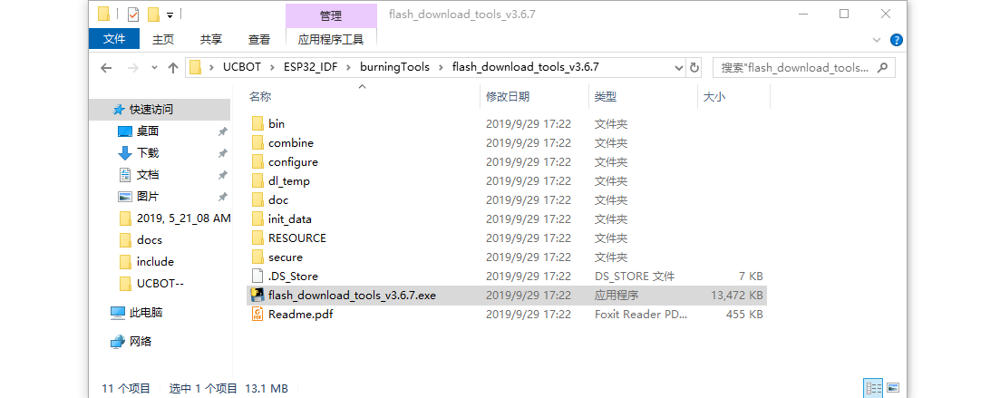
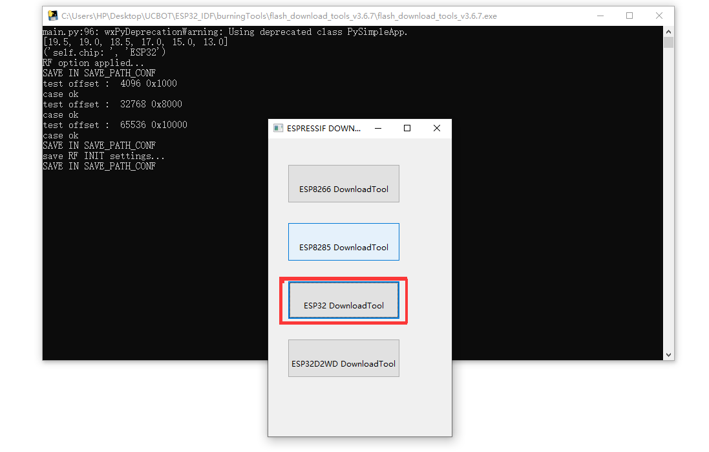
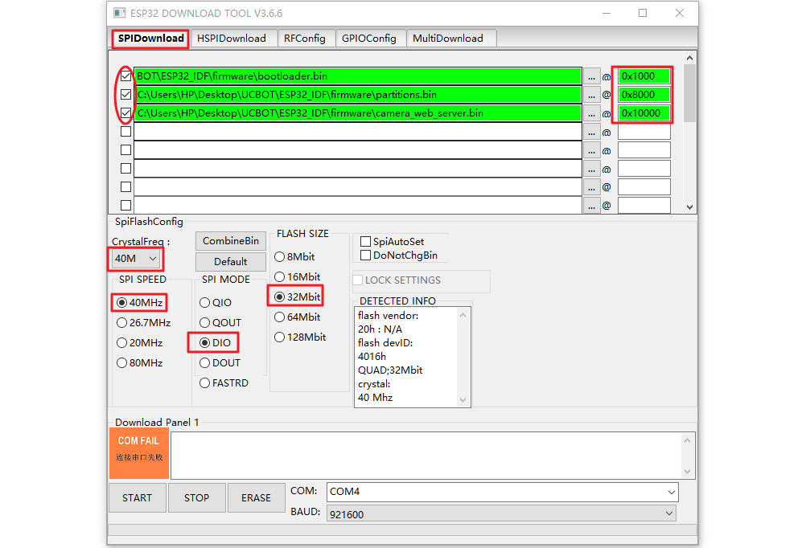
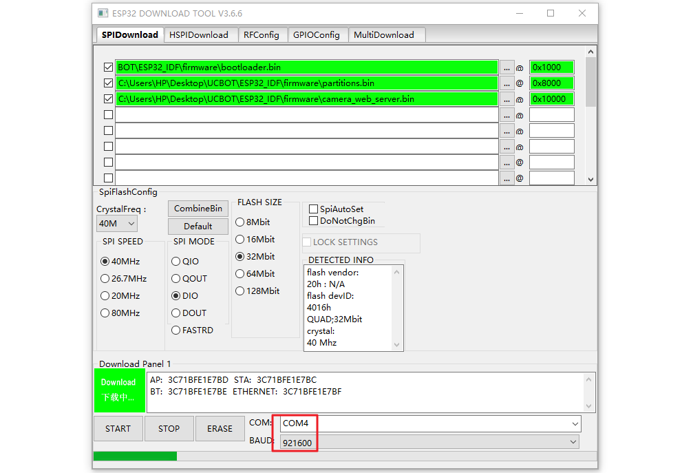

## Overview

ESP-IDF is the official development framework for the [ESP32](https://espressif.com/en/products/hardware/esp32/overview) chip.UCBOT is a smart car robot developed by UCTRONICS based on ESP-IDF.This page shows how to flash the compiled firmware into the UCBOT.

## How to flash factory firmware

- Clone the UCBOT Repository and open the flash_download_tools_v3.6.7.exe(UCBOT > ESP32_IDF > burningTools > flash_download_tools_v3.6.7)

- After opened the flash_download_tools_v3.6.7.exe, select ESP32 DownloadTool.

- Set the options highlighted in red. Connect UCBOT to PC with micro USB and choose the correct COM number.

- Click 'START' and waiting it downloads success.

