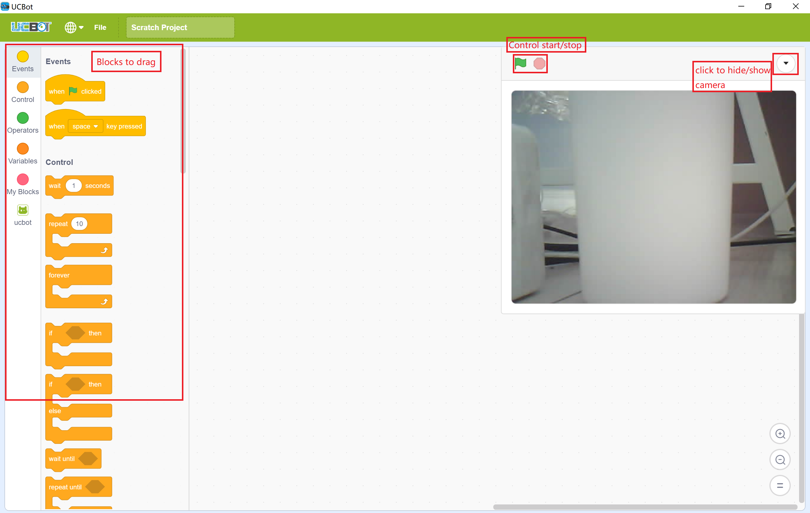

#### Scratch Guide

#### install guide
1. open UCBOT.exe to install
2. after install finished, launch the app
3. connect to ucbot's wifi from system's wifi list
4. start to play

#### App guide
1. App's UI include  
  
2. How to play
    1. First, move flag block from Events   
      
    2. Move ucbot blocks such as Move-Block  
      
    3. You can choose directions from block menu (such as forward,back,etc.)  
    
    4. Or you can drag other blocks you want below
    5. When finished dragging, click the green flag button to start or red to stop
    
